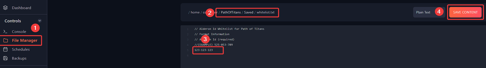

# Creating whitelist for your Path Of Titans server

If you would like only specific players to join, you can create a Whitelist by following steps described below.

**Step 1:** Login to your account on [Fragify panel](https://beta.fragify.net/) and select your Path of Titans server.

**Step 2:** Make sure that the server is stopped. Afterwards, go to **File Manager** on the left-side menu and navigate to `PathOfTitans/Saved` directory. There you will find **whitelist.txt** and you will need to click on it for editing.



## Formatting:
Add the Alderon Games ID (AGID) of each whitelisted user on a new line.

>If you don't know how to find your AGID, you can check [this article](add-admins-find-agid.md).


## Example whitelist.txt
```
525-053-709
525-123-709
123-456-789
```
**Step 3:** Click on **"Save Content"** button and start/restart the server for the changes to be applied.
