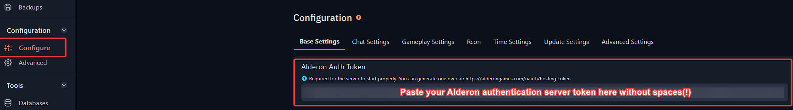

# Setup Authentication Token for your Path of Titans server

1. For the server to properly run and appear in the browser, you will need to generate **Authentication token** which can be done in the following link: https://alderongames.com/oauth/hosting-token

> If you want to hive the database of two servers together using `-Database=Remote`, they will need to the same account. 

When accessing the AUTH Token page, you must be **logged in with an account that owns the game.** This account should be secure, as it will be the AUTH host account for your server.

Please note that after you click "Generate New Token", the page will not display your same token twice if you leave or refresh the page. This is done for security reasons. If you have lost or forgotten your token, you can generate another one via the page, just make sure you update your server with the new token. When you generate a new token any old tokens will be revoked, which can cause issues if they are still in use.

2. Login to the [Fragify panel](VAR::FRAGIFY_URL) and select your Path of Titans server.

3. Go to **Configure** option on the left-side menu and paste your token under `Base Settings` in **Alderon Auth Token** variable.

If the token is not expired and correct, the server will start up properly. 
