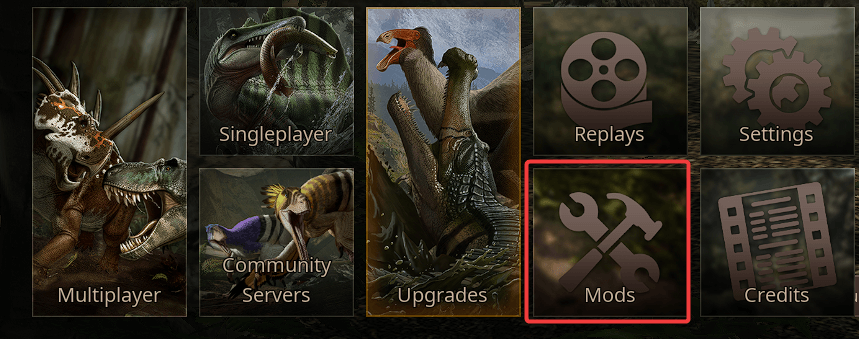
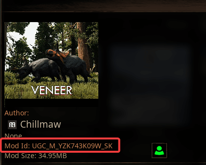
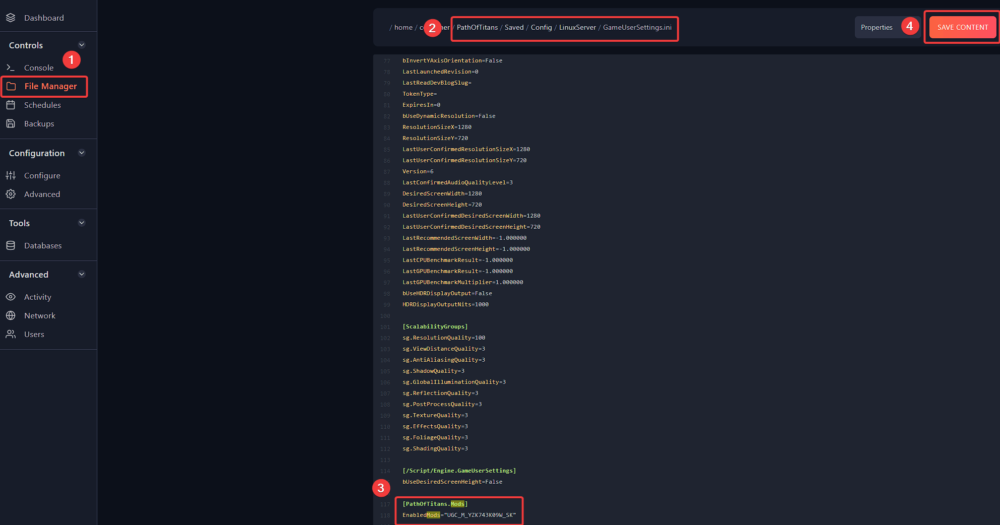
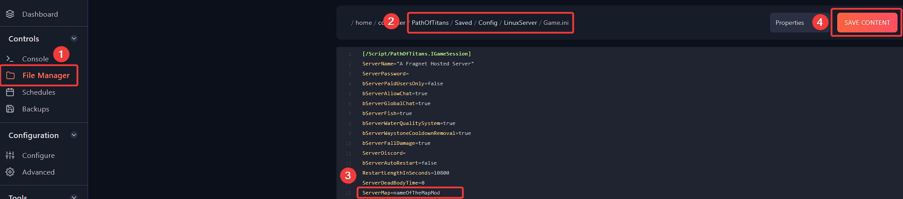

# Setting up Mods on your Path Of Titans server

In order to use a mod you must specify it in your **GameUserSettings.ini** file located in `PathOfTitans/Saved/Config/LinuxServer` directory which can be accessed via **File Manager**. If you are hosting a modded map, you must also change your server config settings to use the modded map name. 

# Finding Mod IDs

You can find the ID of mods by looking at their Mod ID in-game. Select the mod you are interested in, and note down the number on the page.




## Add mods to GameUserSettings.ini
**Important Note:** The server must be stopped while editing server files. You must save your edits and restart your server for any edits to take effect.

You must specify every mod you intend to use in the `GameUserSettings.ini` file.

1. Navigate to `PathOfTitans/Saved/Config/LinuxServer/GameUserSettings.ini` 

2. Add `[PathOfTitans.Mods]` and add the line: `EnabledMods=UGC_M_YZK743K09W_SK` - where `UGC_M_YZK743K09W_SK` is the Mod ID of the mod you want to use for your server.

`UGC_M_YZK743K09W_SK` is the unique MOD ID identifier of the mod to enable which will automatically be downloaded and enabled on restart. You can add additional lines to enable more then one mod at a time.

>Example of the way GameUserSettings.ini looks like with multiple mods:
```
[PathOfTitans.Mods]
;TheGrimExpanse
EnabledMods="UGC_M_DYV7XYEGX2_SK"
;German Shepard Mod (this is a example of mod stacking)
EnabledMods="UGC_M_DYV0XMY7GX_SK"
EnabledMods="UGC_M_YZK743K09W_SK"
```


# Changing Default Server Map to Mod Map
If you are using a modded map on your server, you must specify the modded map name in your `Game.ini` file.

1. Navigate to `PathOfTitans/Saved/Config/LinuxServer/Game.ini`.

2. Under the header `[/Script/PathOfTitans.IGameSession]` add the line `ServerMap=TheGrimExpanse` where `TheGrimExpanse` is the map name of the mod you want to use for your server. This name must be written exactly as specified in the mod files. Generally, this will be the same name as the mod, however you may want to check with the mod author to make sure you have the correct mod map name.

>Example Game.ini
```
[/Script/PathOfTitans.IGameSession]
ServerMap=TheGrimExpanse
```


If everything is set up correctly, your mods should now show up after restarting your server, and will auto download required mods when players join. On the community server browser tab, you can also click "Details" to see a list of all mods that your server is currently running.
