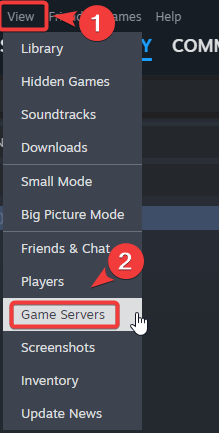
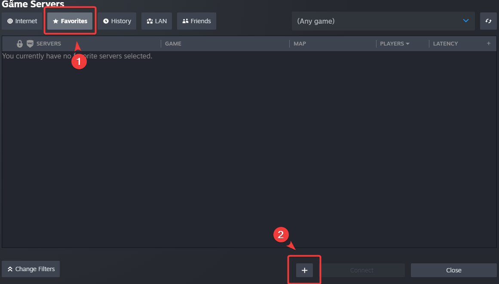
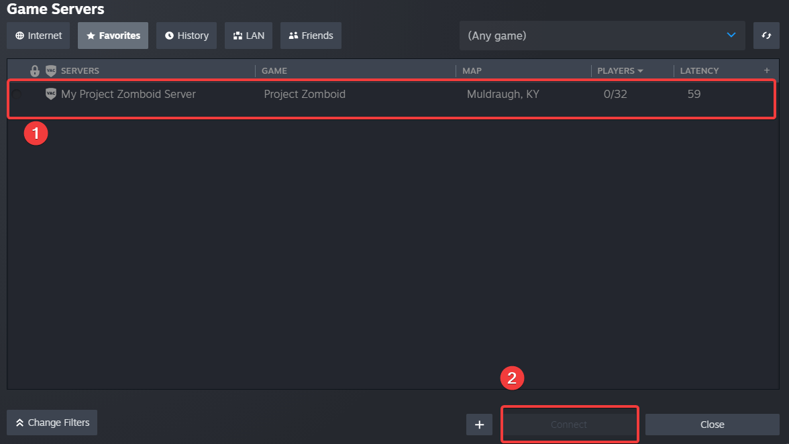
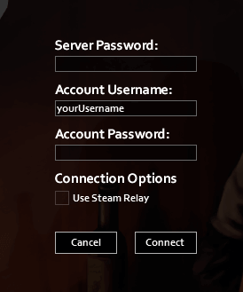
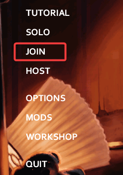
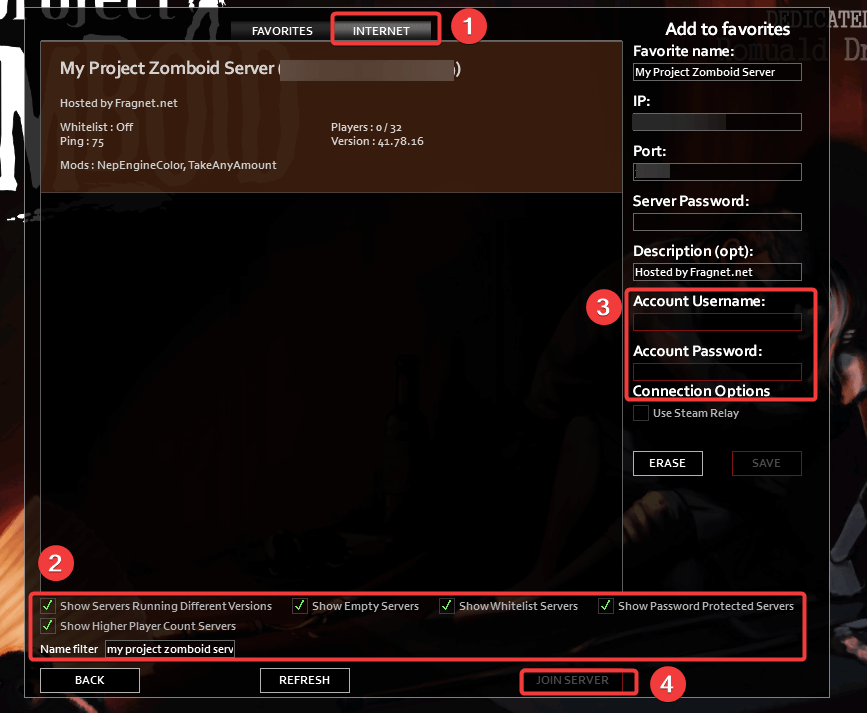

# Finding and connecting to your Project Zomboid server

You can find and connect to your Project Zomboid server in 2 ways which are described in this article.

## Via Steam

1. Copy your IP address and port of your Project Zomboid server from your [Fragify panel's account](https://beta.fragify.net/)

2. Launch your Steam client and go to `View` tab on top-left side of the client => click on `Game Servers` option.

3. Go to **Favourites** tab in the new window and click on **+** sign to add a new server in Favourites list.

4. Input the IP and port of your server in the new window and click on **Ok** button.

5. The server should appear in your favourites and you should select it. Afterwards, click on **Connect** button.

6. After the game launched, you will be provided with login details screen and you can set them to your preferences. Click on **Connect** once everything is set.

## Via Server Browser in-game

1. Launch the game and go to `Join` option in the main menu. 

2. Go to **Internet** tab. Input the name of your server that you have set in **Configure** option in Fragify panel and ensure that all the filters are selected. To connect to the server, set your account's username and password. Afterwards, click on **Join Server** option. 

> If you cannot find server, please double-check if correct IP/port/server name are used. 