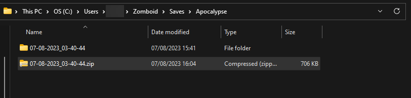

# Uploading your world to your Project Zomboid server

If you would like to continue to play your local world on your server, you can follow steps described in this guide. 

## Finding your local world files

1. Navigate to `C:\Users\yourUsername\Zomboid\Saves` directoy and you can see the folders for different game playstyles selected in **Solo** option in the main menu.

If you have played previously on the server, the location of files will be in **Multiplayer** folder.
If you have played locally, you can go to one of the folders depending on the chosen game playstyle when the world was generated. 

2. You will need to make a zip archive of the save. 
Example for Multiplayer world:

Example for singleplayer Apocalypse world:

# Uploading your world and switching your server to it.

1. Navigate to your [Fragify panel](https://beta.fragify.net/) and select your Project Zomboid server. 

2. Go to **File Manager** => `pzserver/Saves/Multiplayer` directory. Drag and drop zip archive or use **Upload** button. Afterwards, you can click on **...** and select **Unarchive** option. 

3. Afterwards, you need to go to **Configure** option on the left-side menu and input the same name as the folder that you have created in **File Manager** in `Base Settings => Server Name`.

4. Start/Restart the server for the uploaded world to load. 