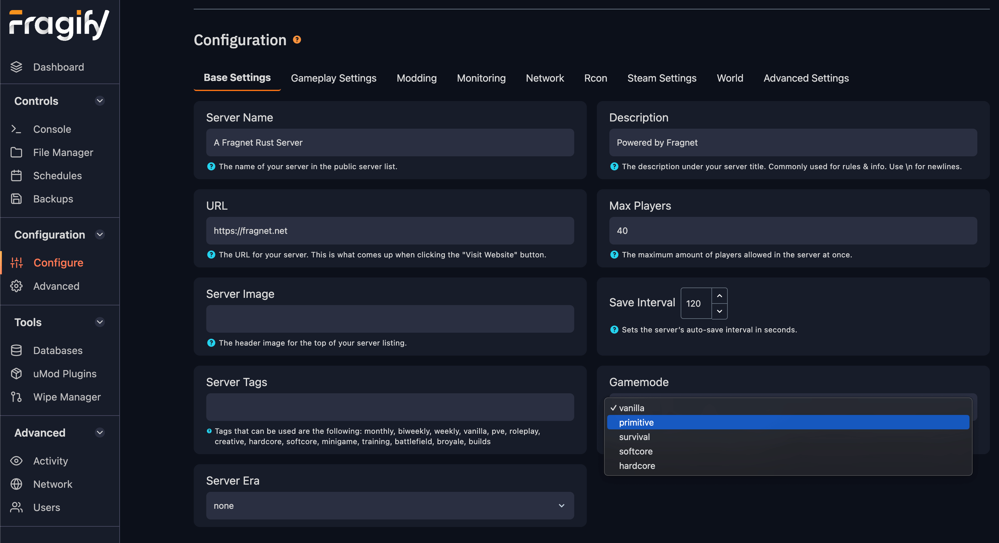

## What is the Primitive Game Mode?

The **Primitive Game Mode** is an officially supported game mode in RUST that allows server owners to create a more survival-focused experience. Similar to Hardcore and Softcore modes, it removes many modern and late-game elements, keeping players in a "primitive" state with limited access to technology, weapons, and structures.

This mode restricts advanced weapons, removes certain monuments and NPCs, and enforces simpler building tiers, shifting gameplay towards more strategic base building and primitive raiding tactics. Additionally, server owners can adjust the level of "primitiveness" by selecting different **Eras**, each unlocking specific technologies and crafting recipes.

The **Primitive Game Mode** was officially introduced in the **February 2025 Primitive Update**.

---

## Enabling Primitive Game Mode on your server

To activate the **Primitive Game Mode**, simply navigate to the **Configure** page in the **Fragify** control panel. Under the **Base Settings** tab, you will find an option to choose the new game mode:

Additionally, you can customize the game mode further by setting an **Era** and various other gameplay parameters from the **Configure** tab.

---

## Understanding Eras in Primitive Mode

The **Eras** system in Primitive Game Mode allows you to control technological progress over time. Each Era introduces specific restrictions on weapons, building materials, and tools.

### Available Eras

| Era       | Effect                                                                         |
| --------- | ------------------------------------------------------------------------------ |
| None      | No restrictions (vanilla gameplay).                                            |
| Primitive | Most restrictive, removing modern weapons, tools, and structures.              |
| Medieval  | Adds basic firearms like the Revolver, Blunderbuss, and Double Barrel Shotgun. |
| Frontier  | Similar to Medieval but may introduce additional items.                        |
| Rust      | Restores full vanilla gameplay.                                                |

### Additional Options

Under the **Configure** tab, we provide additional settings to fine-tune your Primitive server:

| Option                         | Description |
|--------------------------------|-------------|
| **NPC Spawn on Junkpiles**     | Allows scientist NPCs to spawn on roadside junkpiles. Overwritten by `Scientist Spawners Enabled`. |
| **Scientist Spawners Enabled** | Enables or disables scientist NPC spawn locations across the map. |
| **Enforce Era Restrictions**   | Ensures all restricted items that bypass restrictions are removed. |

### Era-Specific Restrictions

Each Era applies a unique set of restrictions, primarily on weapons, construction materials, and NPC presence. Below is a summary of the restrictions in Primitive mode.

#### **Items Disabled in Primitive Mode**

##### **Weapons**

- Assault Rifles (AK, LR-300, M249, etc.)
- Bolt Action & Sniper Rifles (L96, M39, etc.)
- SMGs (MP5, Thompson, etc.)
- Shotguns (Spas-12, Pump Shotgun, etc.)
- High-tech attachments (8x Scope, Laser Sight, Silencer, etc.)
- Prototype and experimental weapons (Prototype 17, Minigun, etc.)

**Exceptions:** Some weapons become available in **Medieval and Frontier Eras**, including:

- **Revolver** (Enabled in Medieval & Frontier)
- **Blunderbuss** (Enabled in Medieval & Frontier)
- **Double Barrel Shotgun** (Enabled in Medieval & Frontier)

##### **Construction & Structures**

- **Armored doors and double doors**
- **High-tier workbenches (Level 3)**
- **Advanced metal armor (Metal Chestplate, Facemask, etc.)**

##### **Tools & Equipment**

- **Chainsaw & Jackhammer** (Can still be looted but not purchased)
- **Timed Explosive Charges (C4) & Satchel Charges**
- **Workbench Level 3**

##### **Ammunition & Explosives**

- **Most firearm ammunition** (5.56, HV, Incendiary, etc.)
- **Rocket Launcher & Explosive Rounds**
- **MLRS Rockets & Aiming Modules**
- **High-tech explosive devices (Homing Missiles, MLRS Aiming Modules, etc.)**

##### **Traps & Defenses**

- **SAM Sites** (No automatic anti-air defenses)
- **High-tech security measures** (Turrets, advanced traps, etc.)

##### **Components**

- **Rifle Body, SMG Body, Semi-Auto Body, Metal Spring** (Cannot be crafted or looted)

---

## Customizing Your Primitive Mode Server

As a server owner, you have full control over how **Primitive Mode** plays out. You can:

- **Manually switch Eras** under the **Configure** tab to progress gameplay.
- **Restrict specific items further** by disabling crafting or modifying loot tables.
- **Enable limited NPC spawns** through configuration options.

This allows you to fine-tune the experience for your community, whether you want a fully primitive survival mode or a more structured, era-based progression system.
