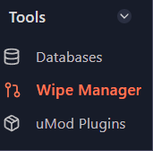
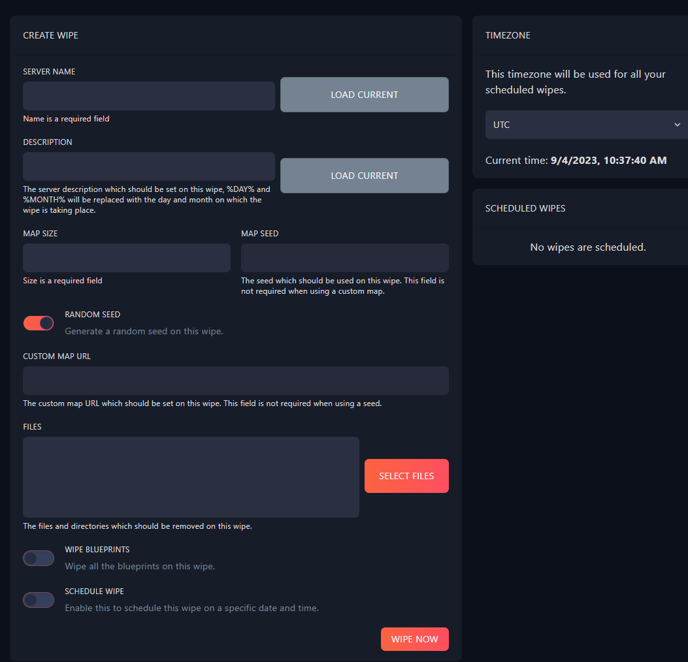

# How to wipe your Rust server and/or Player Data

It is recommended that Rust server owners reset their worlds every 30-days to help keep their server community active.  

By doing the following steps, you will **irreversibly** delete your world file and/or player data.  

There are two ways you can wipe data from your Rust server:

# #1 Using the Fragify Wipe function
----------------------------------

*   Login to the [Fragify panel](https://beta.fragify.net/auth/login) and select your Rust server.

*   Navigate to **Wipe Manager** function on the left-side menu.

*   Set the **name**, **description**, **map size** and **map seed** to your preferences or set to 0/empty to be left unchanged. 
> If you wish to set a random seed on every wipe, click on **Random Seed** to be enabled.

*   If you want to remove specific files, you can click on **Select Files** and choose the files. 

* You can also choose to **Wipe Blueprints** after wipe, and **Schedule Wipe** for custom time and date. 

*   Once ready, press the **Wipe Now** button.

*   Your server will restart, and everything your selected will be wiped  

# #2 Manual wipe
--------------

Manual wipe is done either via File Manager on our Fragify panel.    
  
Navigate to your `/server/yourServerIdentity` folder (by default it's `/server/rust`).  
Your world and player data is stored here.

To delete the **player data only**, delete the player **\*.db** files. This includes blueprints, inventories, positions, etc.  

Delete every file that starts with **player\_.db**.

To delete the **world data only**, delete the files ending with **.map** and **.sav**. If you're not using a custom map, this file will be labelled "proceduralmap".   

If you want to wipe your server entirely, you need to delete all the files mentioned above.

By deleting these files, you will **irreversibly** delete your world file and/or player data. Be careful when proceeding with this!