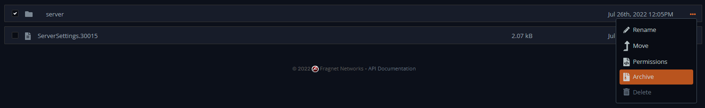
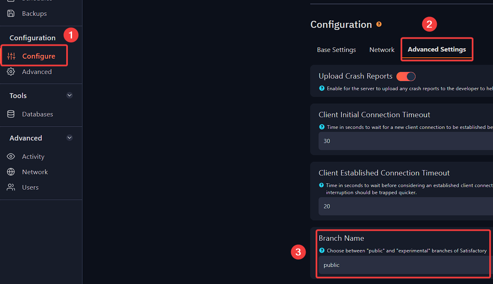

# Switching to experimental version your Satisfactory server
Firstly we’ll need to delete the server files for new ones to be created for the experimental version.

**WARNING: This will delete all of your sessions**

1\. Stop your server and navigate to your **File Manage** on the game panel then go to `config => Epic => FactoryGame => Saved => SaveGames => server`.

If you wish to have a backup, simply go back one directory, tick the box near the server folder, navigate to the **...** alongside the bar, a small menu will appear and click on **Archive** as illustrated in the screenshot here.

2\. Once ready, delete the contents of the **server** folder.

3\. Go to your Fragify game panel and navigate to **Configure** and find **Branch Name** under `Advanced Settings`.

5\. Choose **experimental** option and start your server.

6\. Done! Your server is now running on experimental mode.